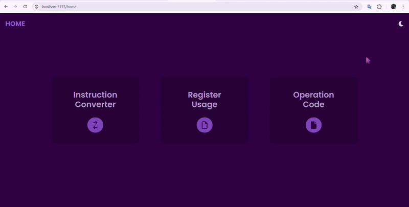
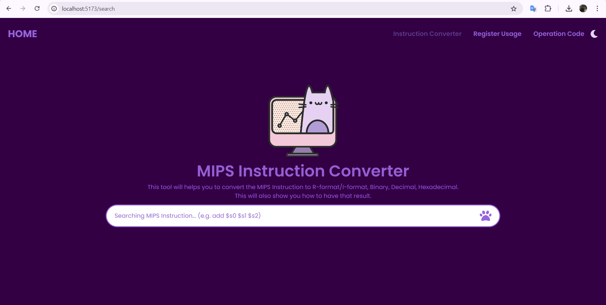
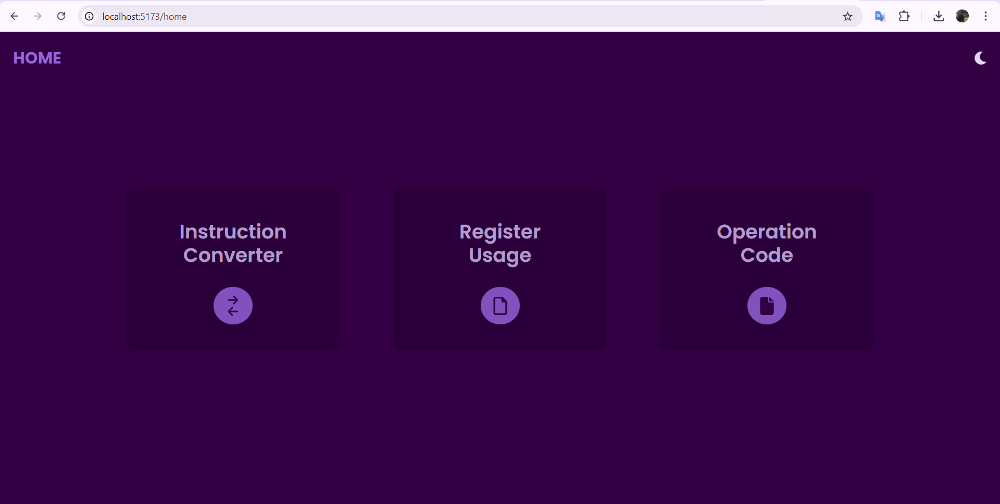
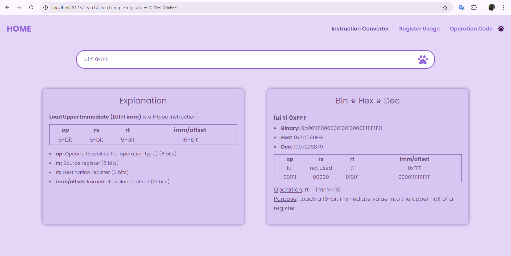
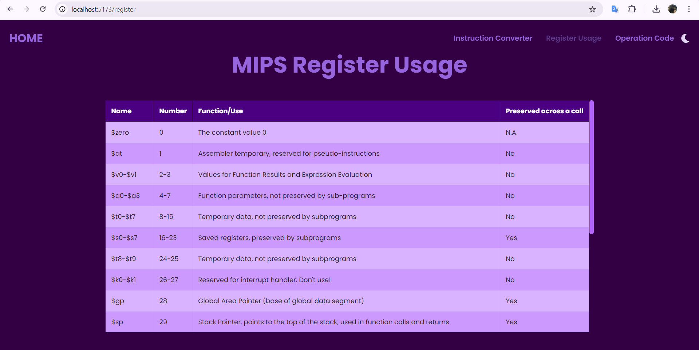
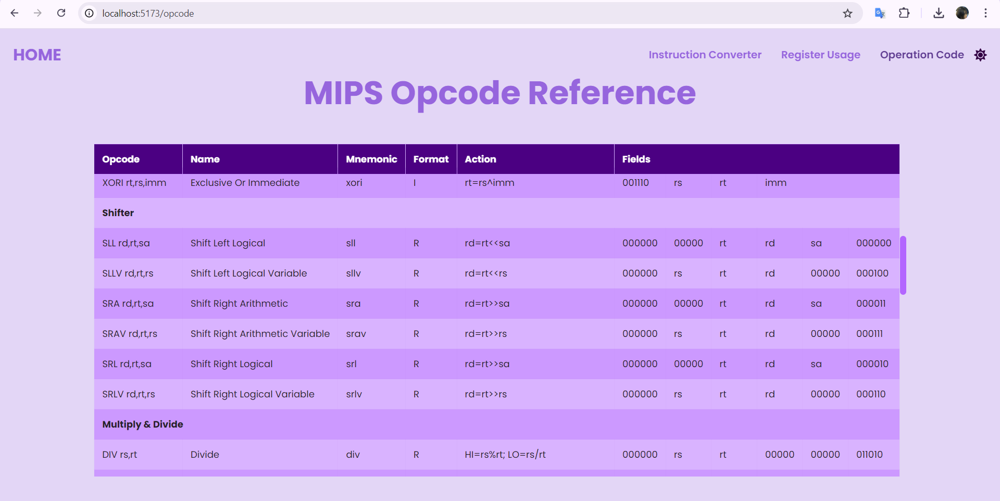

<div align="center">
  
</div>

<div align="center">    
    <h1>MIPS INSTRUCTION CONVERTER</h1>    
    <strong>MIPS Instruction Converter Tool</strong> is a web-based application that allows users to convert MIPS assembly instructions into their corresponding binary, decimal, and hexadecimal formats.This tool also provides detailed explanations of each instruction, including the operation codes (opcodes) and registers.
</div> 

## :clipboard: Table of Content 

1. [Introduction](#introduction)
2. [Getting started](#getting-started)
3. [Technologies Used](#technologies-used)
4. [UI Interface](ui-interface)
5. [Future Updates](#future-updates)
6. [References](#references)
7. [MIT License](#mit-license)

<!-- Introduction -->
## :placard: Introduction <a name="introduction"></a> 
### :cinema: Demo:
<div align ="center">
    
</div>

### :hammer_and_wrench: Features:

- **MIPS Instruction Conversion**: Convert MIPS assembly instructions into binary, decimal, and hexadecimal representations.
- **Detailed Explanations**: Provides explanations for each instruction, including registers and operation codes.
- **User-Friendly Interface**: Intuitive interface with a search bar and navigation components for a smooth user experience.
- **Real-Time Feedback**: Get immediate results and explanations upon entering MIPS instructions.
- **Syntax Validation**: Results are only displayed when the correct MIPS instruction format is entered. If the format is incorrect, a message indicating "wrong syntax" will be shown.

## :rocket: Getting started <a name="getting-started"></a>
### :construction: Project Structure
The project is divided into two main folders:
- __backend__: Contains all server-side code, including resources and utilities.
- __frontend__: Houses the client-side code, including components, pages, utils, and assets.

### Installation

1. **Create Project Folders:**

   ```bash
   mkdir backend
   mkdir frontend
   ```

2. **Set up the Frontend:**

   - Creating a new Vite project (Framework: React; Variant: JavaScript):

     ```bash
     npm create vite@latest converter
     ```

   - Install dependencies:

     ```bash
     cd converter
     npm install
     npm install react-router-dom react-icons react-modal axios moment
     ```

3. **Set up the Backend:**

   - Initialize a new Node.js project:

     ```bash
     npm init
     ```

   - Install dependencies:

     ```bash
     npm install express mongoose jsonwebtoken dotenv cors nodemon
     ```

### Running the Application

1. **Run the Frontend:**

   ```bash
   cd frontend/converter
   npm run dev
   ```

2. **Run the Backend (Server):**

   ```bash
   cd backend
   npm start
   ```
  
<!-- Technologies Used -->
## :gear: Technologies Used <a name="technologies-used"></a> 
1. __Text Editors/IDEs__: Visual Studio Code (VSCode)
2. __Browser for Testing__: Google Chrome
3. __Database__: JSON files for MIPS instruction storage
4. __Frontend__: React, Vite, Tailwind CSS
5. __Backend__: Node.js, Express.js
6. __Tools__: Axios, ESLint, PostCSS
7. __Collaboration and Communication__: Github

## :sparkler: UI Interface <a name="ui-interface"></a>
### :paw_prints: Search Page in dark mode:
The __Search Page__ allows users to input MIPS assembly instructions and search for their binary, decimal, and hexadecimal representations.
<div align ="center">
    
</div>

### :paw_prints: Home Page in dark mode:
The __Home Page__ provides quick links to key sections, as the Search, Opcode, and Register pages.
<div align ="center">
    
</div>

### :paw_prints: Result Page in light mode:
The __Result Page__ displays the conversion results for the entered MIPS instruction. 
<div align ="center">
    
</div>

### :paw_prints: Register Page in dark mode:
The __Register Page__ provides information on the various registers used in MIPS instructions. 
<div align ="center">
    
</div>

### :paw_prints: Opcode Page in light mode:
The __Opcode Page__ lists and explains all supported MIPS operation codes (opcodes).
<div align ="center">
    
</div>

## :crystal_ball: Future Updates <a name="future-updates"></a> 
__Feature Goal__: Align the conversion results (binary, decimal, and hexadecimal) with an adjustable horizontal scale for easier comparison and visualization.


## :books: References <a name="references"></a> 
MIPS instructions come in different formats, primarily R-type, I-type, and J-type, each with its own structure:

1. **R-type (Register)**: Used for arithmetic and logical operations.
   - Format: `opcode rs rt rd shamt funct`
   - Example: `add $s1, $s2, $s3` (adds the values in `$s2` and `$s3`, stores the result in `$s1`)

2. **I-type (Immediate)**: Used for instructions with immediate values.
   - Format: `opcode rs rt immediate`
   - Example: `addi $s1, $s2, 100` (adds the value in `$s2` and the immediate value `100`, stores the result in `$s1`)

3. **J-type (Jump)**: Used for jump instructions.
   - Format: `opcode address`
   - Example: `j 10000` (jumps to the address `10000`)

## :scroll: License <a name="license"></a> 

This project is licensed under [MIT License](https://github.com/ume-meu/mips-instruction-converter/blob/main/LICENSE).
